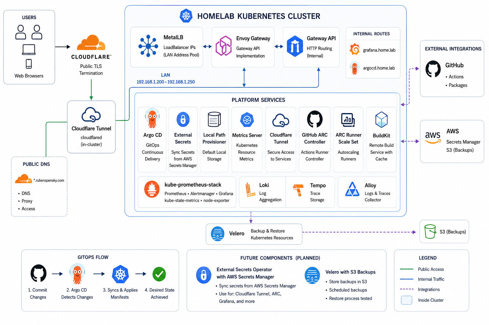

# Kubernetes Infrastructure GitOps

GitOps-managed Kubernetes infrastructure for a homelab platform.

This is the active infrastructure repository: [rubenspensky-homelab/infrastructure](https://github.com/rubenspensky-homelab/infrastructure).

This repository defines the cluster infrastructure components managed by Argo CD. Application workloads are delegated to the separate `homelab-apps` repository.

## Architecture

## Cluster Hardware

| Node | Role | OS | Host | CPU | GPU | Memory | Root Disk |
| --- | --- | --- | --- | --- | --- | --- | --- |
| `k8s-control-01` | Control plane node | Debian GNU/Linux 13 (trixie) x86_64 | Gigabyte Z97N-WIFI | Intel Core i5-4590, 4 cores, up to 3.70 GHz | NVIDIA GeForce GTX 1060 6GB; Intel integrated graphics | 15.46 GiB | 446.14 GiB ext4 |
| `k8s-worker-01` | Worker node | Debian GNU/Linux 13 (trixie) x86_64 | HP ProBook 440 G7 | Intel Core i5-10210U, 8 threads, up to 4.20 GHz | Intel UHD Graphics | 15.47 GiB | 237.49 GiB ext4 |
| `k8s-worker-02` | Worker node | Debian GNU/Linux 13 (trixie) x86_64 | Lenovo ThinkPad T480 | Intel Core i7-8650U, 8 threads, up to 4.20 GHz | NVIDIA GeForce MX150; Intel UHD Graphics 620 | 7.51 GiB | 118.27 GiB ext4 |

`k8s-control-01` runs Linux kernel `6.12.95+deb13-amd64`; `k8s-worker-01` and `k8s-worker-02` run `6.12.86+deb13-amd64`. Swap is disabled on all nodes.

## Current Components

| Component | Purpose |
| --- | --- |
| Argo CD root app | Bootstraps the app-of-apps deployment model |
| homelab-apps | Registers the external application repository in Argo CD |
| MetalLB | Provides LoadBalancer IPs on the LAN |
| MetalLB config | Defines the LAN IP address pool and L2 advertisement |
| Envoy Gateway | Gateway API implementation for cluster routing |
| Gateway API routing | Defines the homelab gateway and HTTP routes |
| Cloudflare Tunnel | Provides public access through Cloudflare |
| Authentik | Identity provider and SSO for cluster services |
| local-path-provisioner | Default local storage provisioner |
| metrics-server | Kubernetes resource metrics API |
| kube-prometheus-stack | Prometheus, Grafana, Alertmanager, kube-state-metrics, and node-exporter |
| Loki | Log storage backend |
| Tempo | Trace storage backend |
| Alloy | Log and trace collector |
| GitHub Actions Runner Controller | Controller for self-hosted GitHub Actions runners |
| ARC runner scale set | Autoscaling runner set for GitHub Actions |
| BuildKit | Remote build service with persistent cache |
| NVIDIA Device Plugin | Advertises NVIDIA GPUs to Kubernetes workloads |
| NVIDIA DCGM Exporter | Exposes NVIDIA GPU metrics to Prometheus |
| KubeVirt | Kubernetes-native virtualization for running virtual machines |
| CDI | Containerized Data Importer for importing VM disk images into PVCs |
| External Secrets Operator | Synchronizes Kubernetes secrets from AWS Secrets Manager |
| Velero | Cluster backup and restore with S3-compatible object storage |
| CloudNativePG | PostgreSQL operator and shared homelab PostgreSQL cluster |

## Current Routing And Exposure

The cluster uses Envoy Gateway and Gateway API for internal routing.

Current internal routes:

- `grafana.home.lab`
- `argocd.home.lab`
- `auth.home.lab`

Public exposure is handled through Cloudflare Tunnel. Cloudflare provides public TLS termination, so `cert-manager` is not currently required for the public access model.

`cert-manager` may be added later only if the platform needs internal HTTPS certificates, non-Cloudflare ingress TLS, or certificate automation inside the cluster.

## Repository Layout

| Path | Purpose |
| --- | --- |
| `bootstrap/` | Initial Argo CD root application |
| `applications/` | Argo CD `Application` resources for infrastructure components |
| `infrastructure/` | Helm wrapper charts, values, and Kubernetes manifests for each component |
| `docs/` | Operational notes and component-specific documentation |

## KubeVirt And CDI

KubeVirt and CDI installation details, node requirements, and validation commands are documented in [docs/kubevirt-cdi.md](./docs/kubevirt-cdi.md).

## External Secrets Operator

External Secrets Operator synchronizes Kubernetes infrastructure secrets from AWS Secrets Manager. Installation order, AWS credential requirements, manual refresh behavior, and current infrastructure secret mappings are documented in [docs/external-secrets.md](./docs/external-secrets.md).

## Authentik

Authentik deployment structure and the current blueprint-based branding approach are documented in [docs/authentik.md](./docs/authentik.md).

## Bootstrap

High-level bootstrap flow:

1. Install Kubernetes.
2. Install Argo CD.
3. Apply `bootstrap/root-app.yaml`.
4. Let Argo CD reconcile the infrastructure applications from `applications/`.
